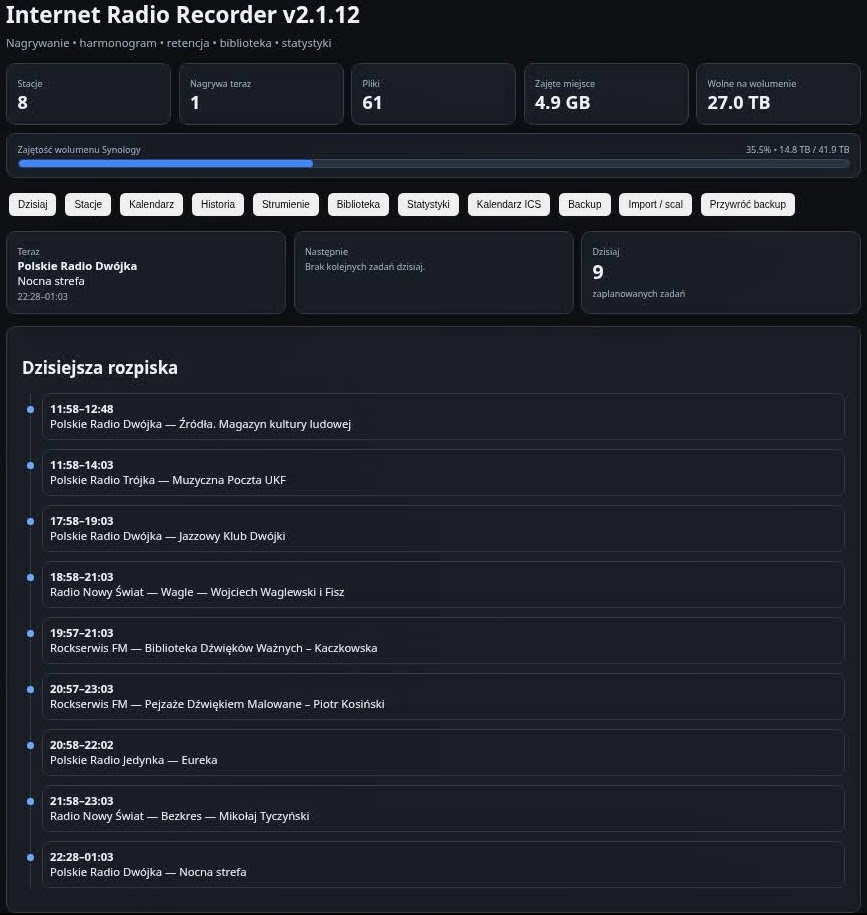
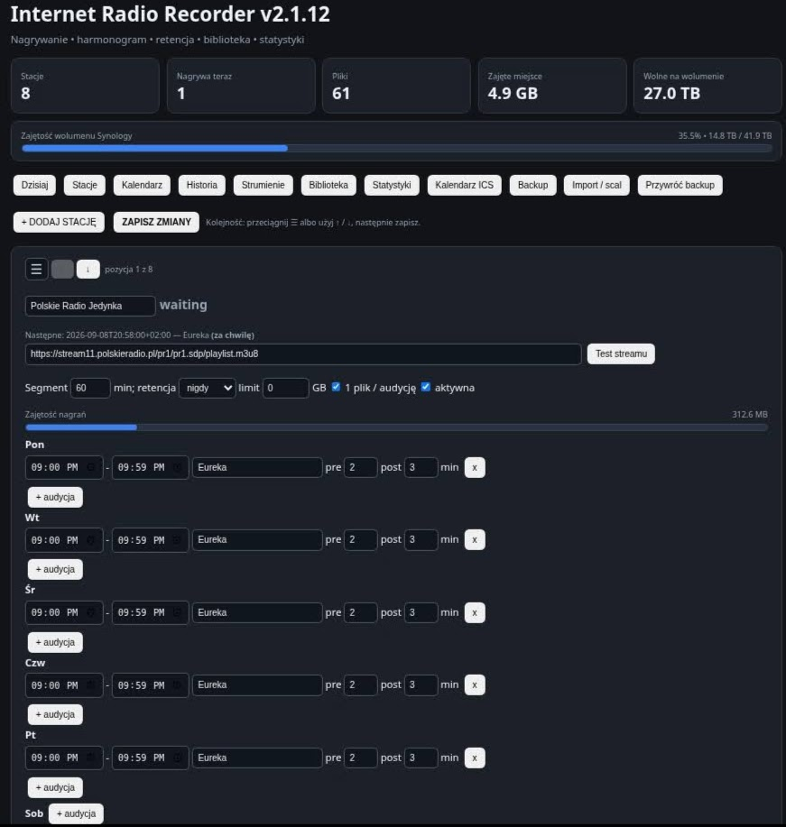
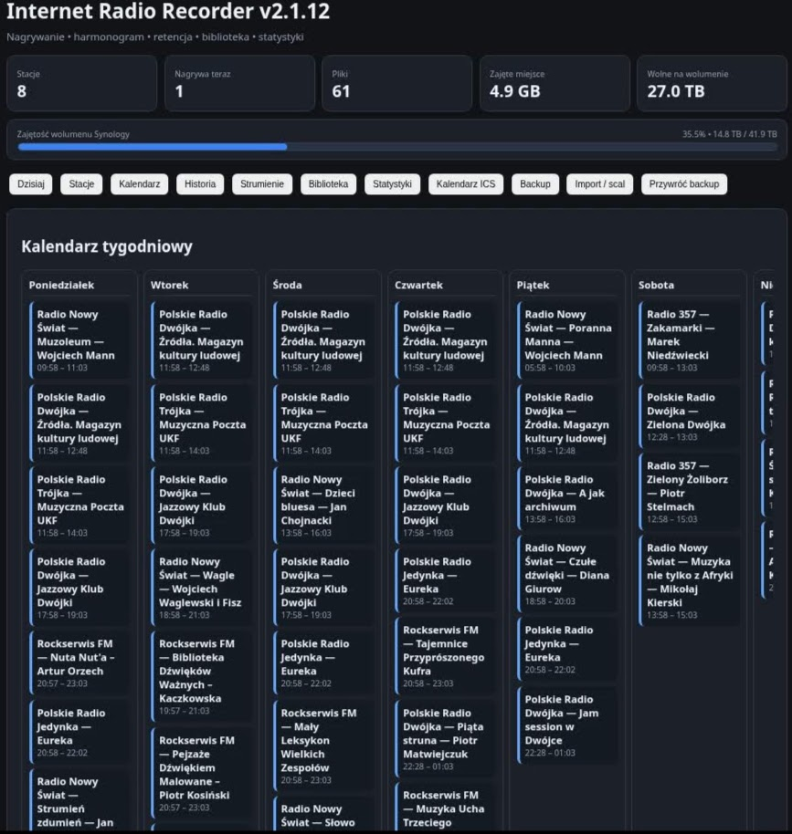
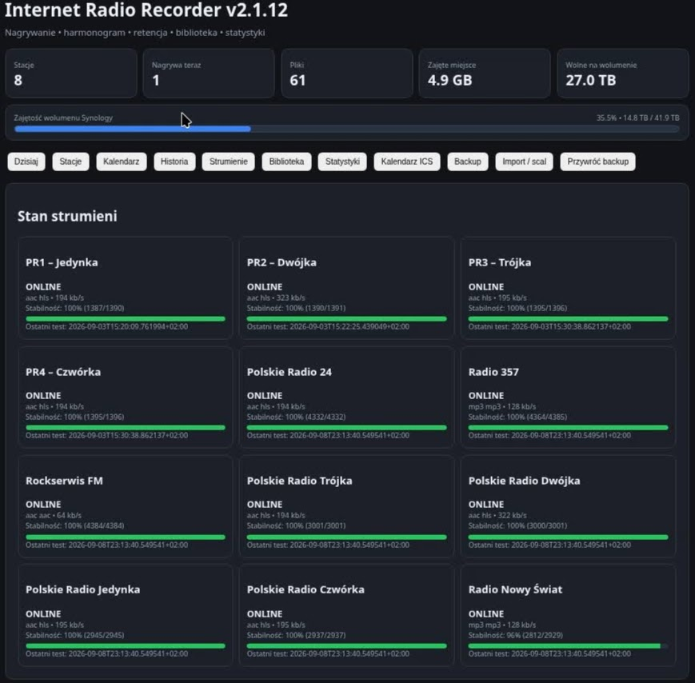
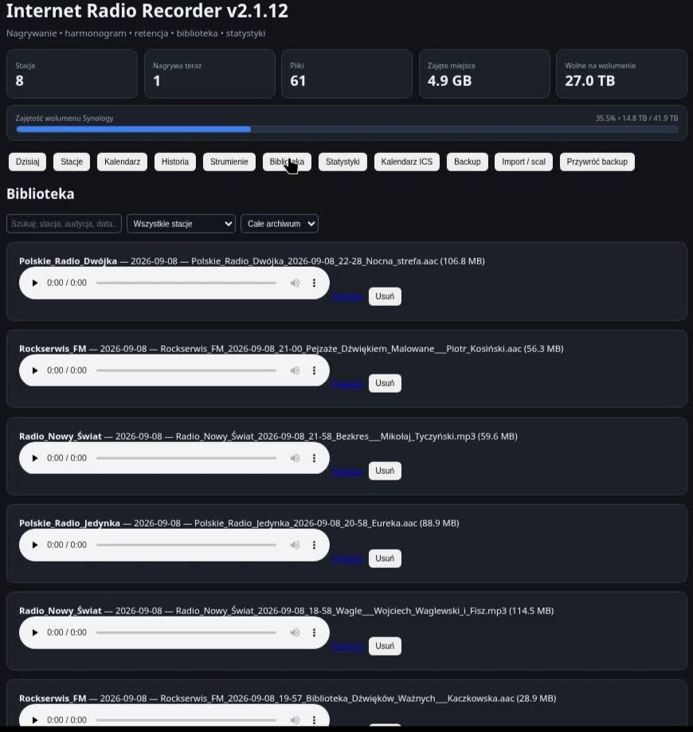
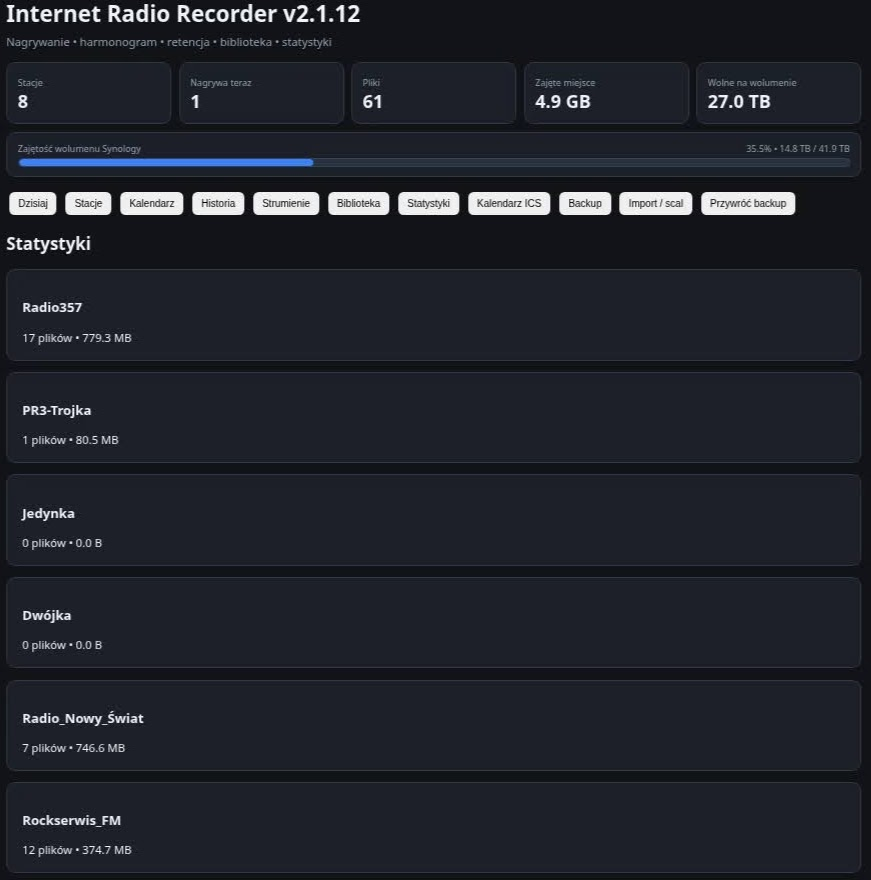

internet-radio · radio-recorder · self-hosted · docker · ffmpeg · python · synology · nas · scheduler · web-ui

**Project Name:** Internet Radio Recorder

**Repo:** https://github.com/sp7uto/internet-radio-recorder

I built Internet Radio Recorder because I wanted a simple self-hosted way to record specific Internet radio shows on my NAS without manually starting VLC, maintaining cron jobs, or running a full broadcasting stack.

It runs in Docker and provides a web UI for managing stations and weekly recording schedules. It can record one file per programme, handle pre/post margins and shows crossing midnight, check stream health, keep a recording library, export an ICS calendar, apply retention limits, and back up or merge station configurations.

I originally built it for my Synology NAS, but it should work on any Docker host.

The current release is v2.1.12.

**Deployment:** Docker Compose is included in the repository, together with a separate Synology/Portainer example and installation documentation.

The project is MIT licensed.

**AI involvement:** AI tools were used during development for coding assistance, debugging, testing and documentation. I directed the project, tested it on my own setup and made the product decisions.

I’d especially appreciate feedback from people who already record Internet radio or podcasts on a home server: what would make this useful enough for you to run permanently?

# Internet Radio Recorder v2.1.12 — Station Order

Release **2.1.12** focuses on easier management of larger station lists and further refinement of the scheduled recording engine.

## Main New Feature

Stations in the web interface can now be arranged in any order:

* by dragging a station card using the `☰` handle,
* or by using the `↑` and `↓` buttons.

After clicking **SAVE CHANGES**, the new order is stored in `stations.json` and remains unchanged after the container is restarted.

Reordering stations does not modify their configuration or recording schedules.

## Fixes Included from 2.1.9–2.1.11

Release 2.1.12 also includes earlier improvements:

* recordings now stop correctly at the scheduled end time,
* adjacent programmes from the same station are saved as separate files,
* correct handling of `pre` / `post` margins,
* correct handling of programmes that cross midnight,
* safe **Import / merge** functionality,
* preservation of existing stations and schedules during import,
* automatic creation of a timestamped configuration backup before import.

## Updating from 2.1.11

Keep your existing file:

```text
/config/stations.json
```

Then replace the application files and rebuild the image:

```bash
docker build --no-cache -t internet-radio-recorder:2.1.12 .
```

Change the container image to:

```text
internet-radio-recorder:2.1.12
```

and redeploy the container.

After the update, it is recommended to perform a full browser refresh:

```text
Ctrl+F5
```

The `stations.json` format has not changed.

## Docker Compose

For a fresh installation:

```bash
cp .env.example .env
cp config/stations.example.json config/stations.json
docker compose up -d --build
```

The default web interface is available at:

```text
http://server-address:8080
```

## Synology / Portainer

The project also includes configuration examples prepared for Synology NAS and Portainer.

Example directories:

```text
/volume1/docker/internet-radio-recorder/config
/volume1/docker/radio
```

## Security

The administration panel **does not include built-in authentication**.

Do not expose the application port directly to the Internet.

Recommended remote access methods:

* Tailscale / VPN,
* or a reverse proxy with HTTPS and authentication.

## Tag

```text
v2.1.12
```

## Commit

```text
88e0b8f — Release v2.1.12
```

Thank you for using Internet Radio Recorder.


# Internet Radio Recorder 2.1.12

Lekki, samodzielny rejestrator internetowych stacji radiowych z tygodniowym harmonogramem, panelem WWW i biblioteką nagrań. Projekt działa w Dockerze i dobrze nadaje się do NAS-ów, w tym Synology.

## Najważniejsze możliwości

- wiele stacji i tygodniowy harmonogram nagrań,
- osobne nazwy audycji oraz marginesy `pre` / `post`,
- tryb **1 plik / audycję** z poprawnym przełączaniem na granicy sąsiednich programów,
- nagrywanie bez ponownego kodowania (`ffmpeg -c:a copy`),
- ręczne `REC` / `STOP`,
- retencja według liczby dni i limit miejsca dla każdej stacji,
- widoki **Dzisiaj**, **Kalendarz**, **Historia**, **Strumienie**, **Biblioteka** i **Statystyki**,
- test strumienia oraz diagnostyka ONLINE/OFFLINE, kodeka, bitrate i stabilności,
- opcjonalne powiadomienia NTFY i webhook,
- kalendarz ICS z tokenem,
- backup konfiguracji,
- **Import / scal** bez kasowania istniejących stacji i harmonogramów,
- przeciąganie stacji oraz przyciski `↑` / `↓` do zmiany ich kolejności.

## Co nowego w 2.1.12

Wersja 2.1.12 dodaje trwałą zmianę kolejności stacji w panelu WWW. Stacje można przeciągać za uchwyt `☰` albo przesuwać przyciskami `↑` i `↓`. Kolejność jest zapisywana bez zmiany formatu `stations.json`, przeżywa restart i backup, a import scalający zachowuje dotychczasowy układ i dopisuje nowe stacje na końcu.

Wersja zawiera też wcześniejsze poprawki 2.1.9–2.1.11: prawidłowe zatrzymywanie nagrań, rozdzielanie sąsiednich audycji i bezpieczny import scalający.

Pełna historia: [CHANGELOG.md](CHANGELOG.md).

## Szybki start — Docker Compose

Wymagania: Docker z Compose v2.

```bash
cp .env.example .env
cp config/stations.example.json config/stations.json
# Zmień przede wszystkim CALENDAR_TOKEN w .env oraz stacje w panelu WWW.
docker compose up -d --build
```

Panel domyślnie będzie dostępny pod:

```text
http://adres-serwera:8080
```

Nagrania są zapisywane w `./recordings`, a konfiguracja i dane pomocnicze w `./config`.

## Synology / Portainer

Dla Synology dołączony jest `docker-compose-portainer.yml` z przykładowymi ścieżkami:

```text
/volume1/docker/internet-radio-recorder/config
/volume1/docker/radio
```

Szczegółowa instrukcja: [docs/INSTALLATION.md](docs/INSTALLATION.md).

## Harmonogram

Każda stacja może mieć wiele wpisów w każdym dniu tygodnia:

```json
{
  "start": "20:00",
  "end": "21:00",
  "title": "Nazwa audycji",
  "pre": 2,
  "post": 3
}
```

`pre` i `post` oznaczają minuty zapasu przed i po nominalnym czasie audycji. Programy przechodzące przez północ są obsługiwane. Przy włączonym **1 plik / audycję** nominalna granica kolejnej audycji ma pierwszeństwo przed nakładającymi się zapasami.

Więcej: [docs/SCHEDULING.md](docs/SCHEDULING.md).

## Backup i import

- **Backup** pobiera aktualne `stations.json`.
- **Import / scal** zachowuje istniejące stacje i harmonogramy, dopisując nowe niekolidujące pozycje.
- **Przywróć backup** zastępuje całą konfigurację.
- Przed importem tworzona jest datowana kopia `stations.before-import-YYYYMMDD-HHMMSS.json`.

Więcej: [docs/BACKUP_AND_MERGE.md](docs/BACKUP_AND_MERGE.md).

## Kalendarz ICS

Subskrypcja:

```text
http://adres-serwera:8080/calendar.ics?token=TWÓJ_TOKEN
```

Token ustawia zmienna `CALENDAR_TOKEN`.

## Bezpieczeństwo

**Panel WWW nie ma wbudowanego uwierzytelniania.** Użytkownik mający dostęp do panelu może zmieniać konfigurację, uruchamiać i zatrzymywać nagrania oraz usuwać pliki z biblioteki. Nie wystawiaj portu 8080 bezpośrednio do Internetu.

Zalecany dostęp zdalny: VPN/Tailscale albo reverse proxy z HTTPS i uwierzytelnieniem. Szczegóły: [SECURITY.md](SECURITY.md).

## Dokumentacja

- [Instalacja i aktualizacja](docs/INSTALLATION.md)
- [Konfiguracja](docs/CONFIGURATION.md)
- [Harmonogram i podział audycji](docs/SCHEDULING.md)
- [Backup oraz Import / scal](docs/BACKUP_AND_MERGE.md)
- [API i endpointy](docs/API.md)
- [Rozwiązywanie problemów](docs/TROUBLESHOOTING.md)
- [Zasady bezpieczeństwa](SECURITY.md)
- [Historia zmian](CHANGELOG.md)

## Wymagania techniczne

Obraz bazuje na `debian:bookworm-slim` i zawiera Python 3 oraz FFmpeg/FFprobe. Kontener działa jako użytkownik systemowy o UID `1000`, dlatego katalogi podmontowane jako `/config` i `/recordings` muszą być dla niego zapisywalne.

## Licencja

Projekt jest udostępniany na licencji **MIT**. Zobacz plik [LICENSE](LICENSE).

<!-- SCREENSHOTS_START -->

## Screenshots

### Today — Scheduled Recordings



### Calendar



### Stations



### Stream Status



### Recording Library



### Statistics



<!-- SCREENSHOTS_END -->
